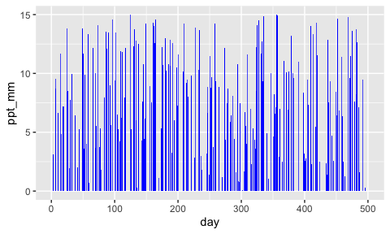

Synthetic forcing data for linear reservoir model
================
Keith Jennings
2023-04-26

# Intro and dependencies

This code generates synthetic precipitation data that you can use for
testing the linear reservoir model.

To run the code, you’ll need:

- An updated version of [R](https://www.r-project.org/)
- `tidyverse` for the `ggplot2` package

You can access any R package through [CRAN](https://cran.r-project.org/)
or in an R session by running `install.packages("packagename")` where
“packagename” is, well, the package name (e.g.,
`install.packages("tidyverse)`).

Additionally, you may want to use an IDE like
[RStudio](https://posit.co/download/rstudio-desktop/) to develop and run
your R scripts and manage R packages.

# Make the data

This is pretty simple, just start your R session and generate some
random numbers.

``` r
library(tidyverse)

# First decide the number of time steps you want
n_steps = 500

# Then provide the probability that a given timestep will have zero precip
probZero = 0.6
isZero = rbinom(n = n_steps, size = 1, prob = probZero)

# Next decide your max and min precip values
ppt_min = 0
ppt_max = 15

# Then generate a random time series of data with the above parameters
R = ifelse(isZero==1, 0, 
           runif(min = ppt_min, max = ppt_max, 
                 n = n_steps))
```

# Format and export the data

We’ll now write the data to a csv file in the project directory.
**NOTE:** These data come with the project, so I’ve commented out the
export code. Remove the hashtags and change the output directory if you
want data in a different location.

``` r
# Put the data into a data frame
df = data.frame(ppt_mm = R,
                day = 1:n_steps)

# Then export
# write.csv(x = df,
#           file = "../examples/data/example_ppt_data.csv",
#           row.names = F,
#           quote = F)
```

# Look at the data

If for some reason you want to see a bunch of blue bars, then you are in
luck. Below are is a plot of the synthetic precipitation data.

``` r
# plot code
ggplot(df, aes(day, ppt_mm)) +
  geom_bar(stat = "identity", fill = "blue") 
```

<!-- -->

Nailed it!

Now, let’s try running `linearresBMI` with these data.
